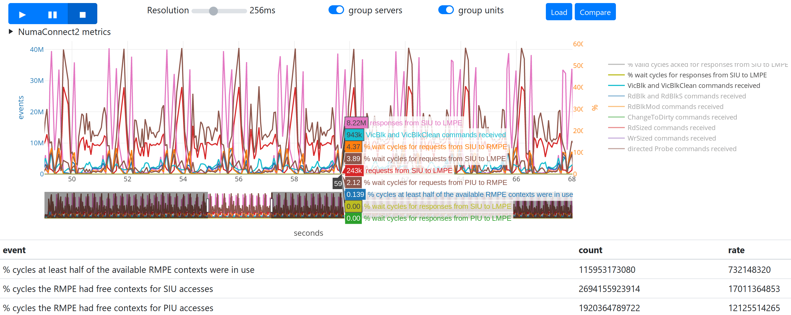

# Numascope Performance Visualiser

Numascope allows live viewing, capture and replay of Numascale's on-chip performance counters, along with useful kernel virtual memory counters.



## Getting Started

### Prerequisites

Use a Linux distro with Go 1.9 or newer, for example Ubuntu 18.04.2 or CentOS 8.

To access on-chip resources via memory-mapped registers, the numascope binary needs to be run as root. This can be achieved by running the binary with sudo, or chowning the binary to root and setting the set-uid bit, so non-sudo/root users can use it.

### Installing

Clone the project:
```
$ git clone https://github.com/numascale/numascope
```

Build the project:
```
$ go build
```

Deploy binary and resources system-wide on target system, running as root:
```
$ sudo mv numascope /usr/local/bin
$ sudo mv resources /usr/local/share/numascope
$ sudo chown root:root /usr/local/bin/numascope
$ sudo chmod u+s /usr/local/bin/numascope
```

Alternatively, the binary can be run from anywhere on the filesystem as root, or with sudo; it will look in the current directory for the 'resources' directory.

## Using the tool

### To get command help
```
$ numascope
Usage: numascope [option...] stat|live|record
  -debug
        print debugging output
  -discrete
        report events per unit, rather than average
  -events string
        comma-separated list of events (default "pgfault,pgalloc_normal,pgfree,numa_local,n2VicBlkXSent,n2RdBlkXSent,n2RdBlkModSent,n2ChangeToDirtySent,n2BcastProbeCmdSent,n2RdRespSent,n2ProbeRespSent")
  -list
        list events available on this host
  -listenAddr string
        web service listen address and port (default "0.0.0.0:80")
```

### To view performance counters live from the console
```
$ numascope stat
numa_local pgalloc_normal pgfree pgfault
         0              0      0       0
      1349           2373   2140     527
     24462         117443 107019  165004
      3773           5621  15623    6258
     14899           2172   2110     186
     32579           2173   2079     201
        31           2203   2110     217
        31           2158   2080     170
```

### To view performance counters live from a browser
```
$ numascope live
web interface available on port 80
```
You can now point your browser to http://`<hostip>`, or use SSH port forwarding

Single-clicking lines in the legend (de)select them, whereas double-clicking (un)isolates them.

### To capture events for later viewing
```
$ numascope record
spooling to output.json
```
This allows loading the trace into the HTML5 UI later.

### Annontating the trace
In either live of recording mode, annotations can be added to trace for example to mark when a workload is started, or phases within a workload. This can be done by a user, a script or within the application.
```
$ echo 'phase 1' >/run/numascope-label
```

### Using in offline mode
If live viewing isn't needed, the static web resources can be used in offline mode, eg at [https://resources.numascale.com/numascope/resources/index.html].

This allows loading and interaction with recorded traces.

## Authors

* Daniel J Blueman, Principal Software Engineer @ Numascale

## License

This project is licensed under the GPL v3 License - see the [LICENSE](LICENSE) file for details
